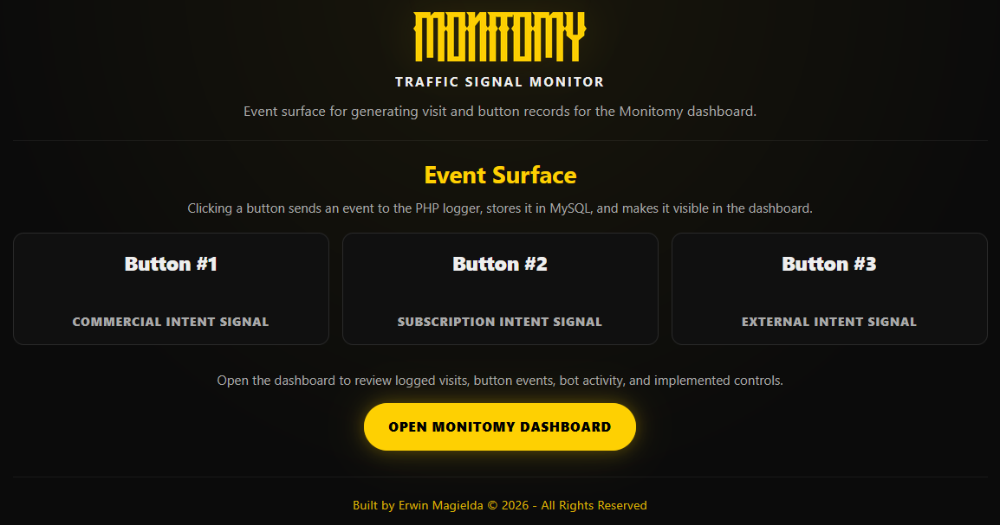
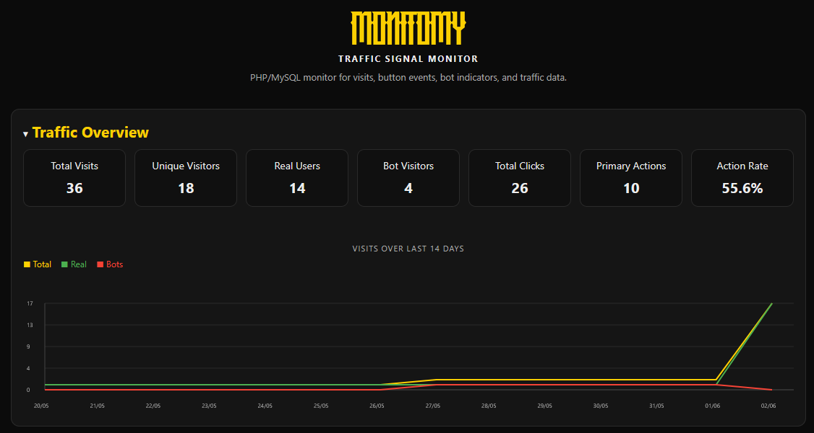
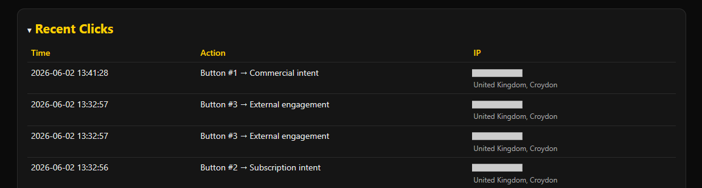
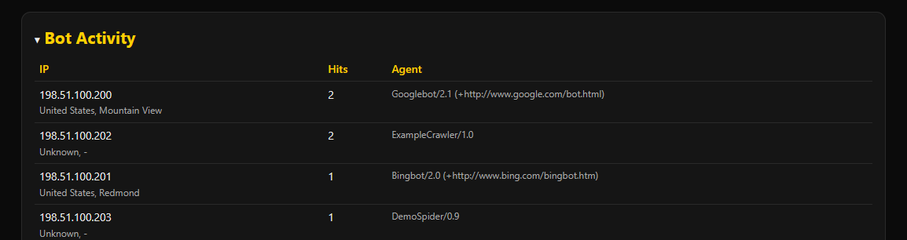
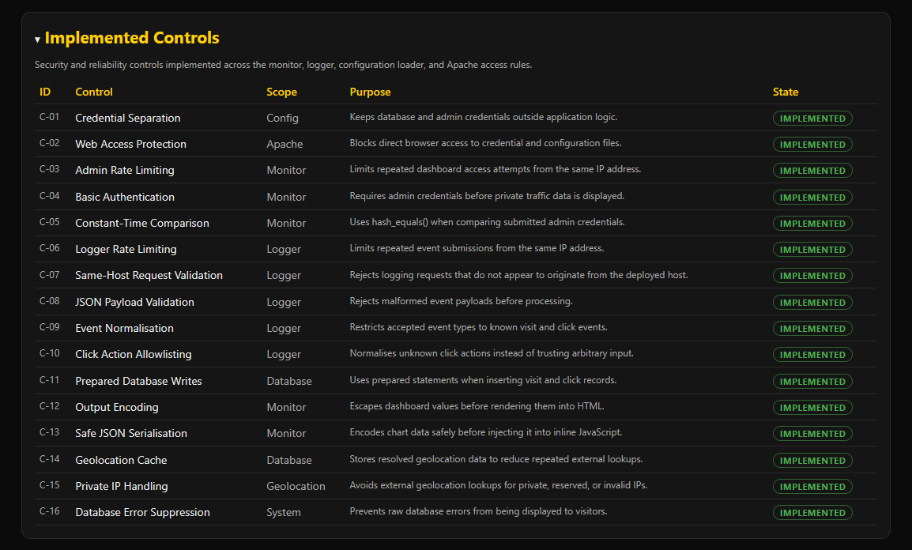
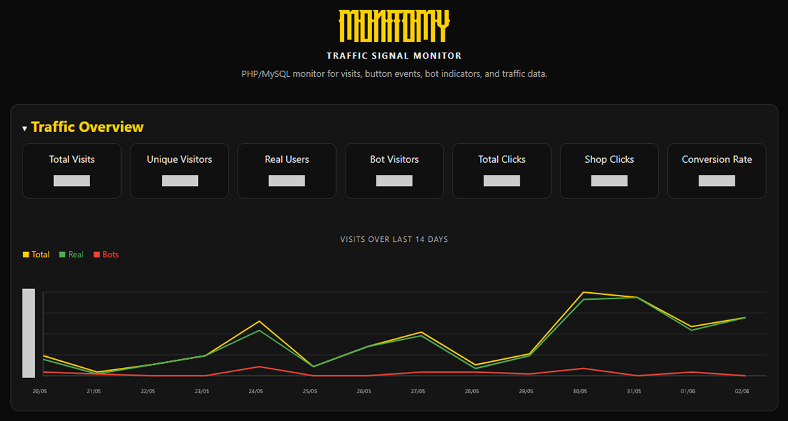

# Monitomy

**Logs website visits and button events into MySQL, then displays the activity in a private PHP dashboard.**

Monitomy is a small PHP/MySQL traffic monitor built around a direct event flow: a browser page sends visit and button events, `log.php` validates and stores them, and `monitomy.php` displays the activity through a private dashboard.

The project started from a practical website monitoring problem:

> I wanted a lightweight way to see whether a page was being visited, which buttons were being clicked, and whether traffic looked human or bot-like.

The repository version uses a neutral event surface with three generic buttons. The same dashboard layout is also used in a private live deployment, shown below with sensitive values blurred.

---

## Purpose

Monitomy keeps the monitoring workflow small and readable. It records basic website activity, stores it in MySQL, and presents it in a private dashboard that can be reviewed without digging through raw server logs.

• **Visit Logging**  
  Records page visits with IP address, user agent, timestamp, and a basic location string.

• **Button Event Logging**  
  Records controlled button events from the event surface using a small allowlisted event set.

• **Dashboard Review**  
  Shows visits, unique visitors, real-user counts, bot-like visitors, button events, primary actions, and action rate.

• **Bot Activity Review**  
  Groups bot-like traffic by IP, hit count, and user agent.

• **Geolocation Cache**  
  Stores resolved IP location data in `ip_geo` so repeated dashboard views do not keep repeating the same lookup.

• **Implemented Controls**  
  Lists the controls that are actually present in the logger, monitor, configuration loader, database writes, and Apache access rules.

---

## Screenshots

The screenshots show the deployed neutral version of Monitomy, plus one sanitised screenshot from the private live monitor.

### Event Surface



The event surface generates the records used by the monitor. Each button sends a different stored action to the logger.

### Traffic Overview



The dashboard gives a quick summary of visit volume, unique visitors, real-user estimates, bot-like visitors, button events, primary actions, and action rate.

### Recent Clicks



Recent Clicks shows button events after they have been written to MySQL and formatted for review in the dashboard.

### Bot Activity



Bot Activity groups user agents that look crawler-like. The proof-of-concept sample data uses safe documentation IP ranges.

### Implemented Controls



The controls table makes the implementation visible. It shows which protections are present and where they apply.

### Sanitised Live Monitor



The private live monitor uses the same dashboard layout against real website traffic. Metric values and sensitive operational details have been blurred.

---

## Technical Capabilities

| Area | Implementation |
|---|---|
| Event Surface | HTML/CSS page with three tracked buttons and a small JavaScript event sender. |
| Event Submission | JavaScript sends `visit` and `click` payloads to `log.php` using `sendBeacon()` with a `fetch()` fallback. |
| PHP Logger | `log.php` validates JSON, rate-limits submissions, checks same-host origin or referer, allowlists actions, and writes records to MySQL. |
| MySQL Storage | `visits`, `clicks`, and `ip_geo` tables store visit records, button events, and cached geolocation data. |
| Private Monitor | `monitomy.php` displays KPI cards, chart data, recent clicks, recent visits, bot activity, top visitors, and implemented controls. |
| Configuration Loading | `db_config.php` loads database and dashboard credentials from `credentials.json`. |
| Access Rules | `.htaccess` disables directory listing and blocks direct access to configuration files. |
| Dashboard Protection | The monitor requires HTTP Basic Authentication before dashboard data is shown. |
| Output Handling | Dashboard output is escaped before rendering, and chart data is encoded safely before entering inline JavaScript. |

---

## Architecture

The repository keeps the web files, database setup, screenshots, and documentation separate.

```text
monitomy/
├── public/
│   ├── .htaccess
│   │   Protects configuration files, disables directory listing,
│   │   blocks Git metadata, and sets basic security headers.
│   │
│   ├── credentials.json
│   │   Dummy credentials template for the repository.
│   │   Real deployment credentials are edited only on the server.
│   │
│   ├── db_config.php
│   │   Loads and validates database and dashboard credentials.
│   │
│   ├── index.html
│   │   Event surface that generates visit and button records.
│   │
│   ├── log.php
│   │   Receives browser events, validates payloads, normalises actions,
│   │   and writes records to MySQL.
│   │
│   ├── monitomy.php
│   │   Private dashboard for reviewing traffic records, bot activity,
│   │   top visitors, click events, and implemented controls.
│   │
│   ├── monitomy.webp
│   │   Monitomy logo used by the event surface and dashboard.
│   │
│   ├── favicon.ico
│   │   Browser favicon.
│   │
│   └── styles.css
│       Styles the event surface.
│
├── database/
│   ├── schema.sql
│   │   Creates the `visits`, `clicks`, and `ip_geo` tables.
│   │
│   └── sample_data.sql
│       Inserts safe demonstration records for screenshots and testing.
│
├── docs/
│   └── screenshots/
│       Stores README screenshots.
│
├── README.md
└── LICENSE
```

A deployed version can sit inside a subfolder such as:

```text
public_html/monitomy-demo/
```

The live website monitor and the neutral proof-of-concept deployment should use separate folders, databases, and credentials.

---

## Workflow

Monitomy follows a simple evidence chain:

```text
Event Surface -> Browser Payload -> PHP Logger -> MySQL Tables -> Private Dashboard
```

Button events follow this path:

```text
Button Click -> Data-Track Value -> JSON Payload -> Allowlisted Action -> Clicks Table -> Dashboard Label
```

Visit events follow this path:

```text
Page Load -> Visit Payload -> IP & User Agent Capture -> Location String -> Visits Table -> Dashboard Metrics
```

The dashboard reads the stored records and builds the review view:

```text
Basic Auth -> Database Reads -> Metrics -> Chart Data -> Tables -> Implemented Controls
```

---

## Operation

The event surface is opened from the deployed folder:

```text
/monitomy-demo/
```

On page load, a visit event is sent to the logger. Each button sends a different click event.

| Button | Stored Action | Dashboard Label |
|---|---|---|
| Button #1 | `button_1` | Button #1 → Commercial intent |
| Button #2 | `button_2` | Button #2 → Subscription intent |
| Button #3 | `button_3` | Button #3 → External engagement |

The dashboard is opened separately:

```text
/monitomy-demo/monitomy.php
```

The monitor asks for the `admin_user` and `admin_pass` set in the deployed `credentials.json`.

---

## Technical Method

Monitomy is split into a small number of files, each with a clear role.

• **Event Surface**  
  `index.html` sends a visit event when the page loads and sends click events when a tracked button is selected.

• **Logger Validation**  
  `log.php` checks request rate, same-host origin or referer, JSON payload shape, event type, and button action before writing to the database.

• **Action Allowlisting**  
  The neutral version accepts only `button_1`, `button_2`, and `button_3`. Unknown actions are stored as `other`.

• **Database Writes**  
  Visit and click inserts use prepared statements.

• **Dashboard Authentication**  
  `monitomy.php` requires Basic Authentication before displaying data.

• **Metric Calculation**  
  The dashboard calculates total visits, unique visitors, real users, bot visitors, total clicks, primary actions, and action rate from the stored records.

• **Bot Grouping**  
  Bot-like activity is grouped using simple user-agent patterns such as `bot`, `crawl`, and `spider`.

• **Geolocation Cache**  
  `ip_geo` stores resolved country and city values for repeated IPs. The dashboard checks the cache before attempting a new lookup.

• **Output Encoding**  
  Dashboard values are escaped before rendering into HTML. Chart data is JSON-encoded with flags that make it safer to embed in inline JavaScript.

• **Control Register**  
  The dashboard includes a controls table so the implementation can be reviewed directly instead of only described in the README.

---

## Setup

### 1. Copy Web Files

Copy the contents of `public/` into a web-accessible folder:

```text
public_html/monitomy-demo/
```

Expected deployed folder:

```text
monitomy-demo/
├── .htaccess
├── credentials.json
├── db_config.php
├── favicon.ico
├── index.html
├── log.php
├── monitomy.php
├── monitomy.webp
└── styles.css
```

### 2. Create MySQL Database

Create a database and database user through cPanel or your hosting panel.

Recommended naming:

```text
monitomy_db
monitomy_user
```

cPanel may add an account prefix to both names.

### 3. Import Schema

In phpMyAdmin, select the Monitomy database and import:

```text
database/schema.sql
```

This creates:

```text
visits
clicks
ip_geo
```

### 4. Import Sample Data

For a populated dashboard, import:

```text
database/sample_data.sql
```

The sample data uses documentation IP ranges and fake user agents.

### 5. Configure Credentials

The repository version of `public/credentials.json` is a template.

Edit the deployed copy only:

```json
{
  "db_host": "localhost",
  "db_name": "your_database_name",
  "db_user": "your_database_user",
  "db_pass": "your_database_password",

  "admin_user": "your_dashboard_username",
  "admin_pass": "your_dashboard_password"
}
```

Do not commit real credentials.

### 6. Check Protected Files

These should not be readable in the browser:

```text
/monitomy-demo/credentials.json
/monitomy-demo/db_config.php
```

### 7. Test the Flow

Open:

```text
/monitomy-demo/
```

Click the buttons, then open:

```text
/monitomy-demo/monitomy.php
```

The clicks should appear under Recent Clicks after logging in.

---

## Project Status

Current status: **functional proof-of-concept with private live deployment evidence**.

• **Implemented Flow**  
  The repository includes the event surface, PHP logger, MySQL schema, sample data, private dashboard, configuration loader, Apache access rules, and screenshots.

• **Neutral Demo Version**  
  The public version uses generic buttons and sample records so the monitoring flow can be reviewed without exposing the original live website or its real data.

• **Live Version Evidence**  
  A sanitised screenshot shows the same dashboard layout used against a private live deployment.

• **Current Use**  
  The project is ready for README review, portfolio screenshots, and controlled deployment on standard PHP/MySQL hosting.

---

## Limitations

Monitomy is deliberately small. The current version focuses on the event path, storage model, dashboard view, and basic controls.

• **Simple Bot Detection**  
  Bot activity is identified through user-agent patterns such as `bot`, `crawl`, and `spider`.

• **Basic Dashboard Login**  
  The dashboard uses HTTP Basic Authentication rather than a full user, session, or role system.

• **Small Event Vocabulary**  
  The neutral event surface uses three generic button events.

• **Simple Rate Limiting**  
  Rate limiting uses temporary files, which is enough for this small deployment but not a full traffic-control system.

• **Basic Geolocation**  
  Geolocation depends on an external IP lookup and cached results.

• **Shared-Hosting Assumptions**  
  The deployment assumes standard PHP/MySQL hosting with Apache `.htaccess` support.

• **Privacy Review Still Matters**  
  A real public deployment should be reviewed for privacy notices, consent expectations, retention needs, and any applicable data protection requirements.

---

## Licence

MIT License. See `LICENSE`.
